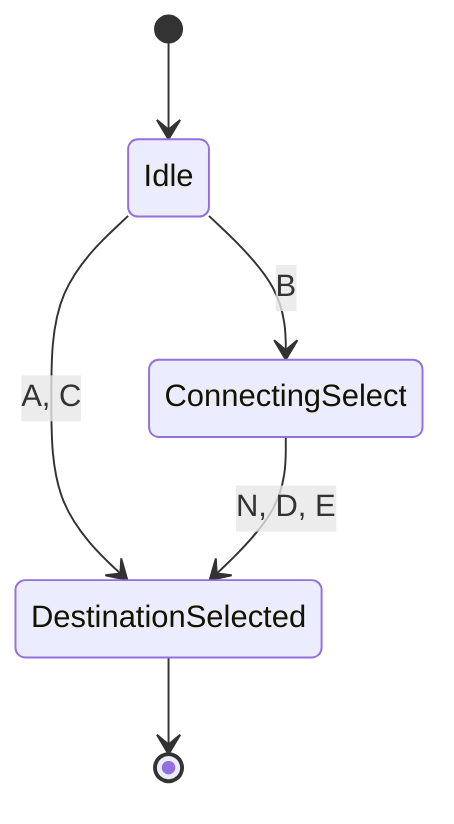
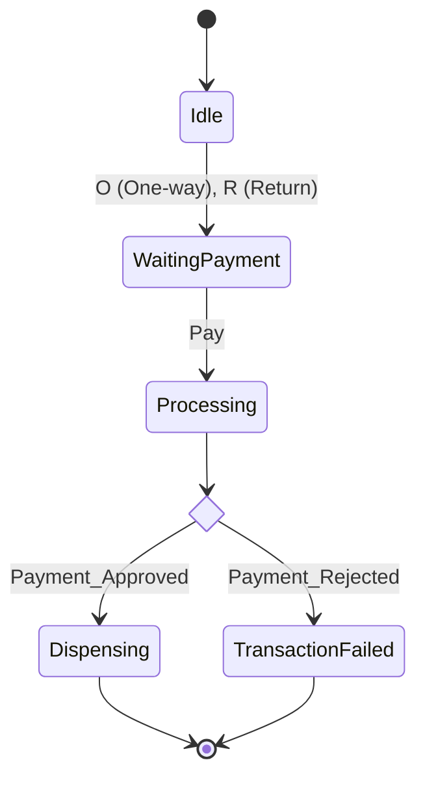

# Coursework Solution Report

## Phase 1: Exercise 1 (Train Ticket Machine)

### Machine M (Destination)

**Description**: This machine handles the destination selection. Direct destinations (A, C) lead immediately to selection. Destination B requires a secondary selection (N, D, E) for connecting trains.

**Mermaid Diagram**:



**State Transition Table (Machine M)**:

| Current State | Input | Next State | Description |
| :--- | :--- | :--- | :--- |
| `Idle` | `A`, `C` | `DestinationSelected` | Direct destination selection |
| `Idle` | `B` | `ConnectingSelect` | Requires connection choice |
| `ConnectingSelect` | `N` | `DestinationSelected` | Selected B with No connection |
| `ConnectingSelect` | `D` | `DestinationSelected` | Selected B with connection D |
| `ConnectingSelect` | `E` | `DestinationSelected` | Selected B with connection E |

**Testing Table (Machine M)**:

| Path Type | Input Sequence | Outcome | Explanation |
| :--- | :--- | :--- | :--- |
| **Accepted** | `A` | **Pass** | Direct selection of destination A leads to the final state. |
| **Accepted** | `B` $\to$ `D` | **Pass** | Selection of B transitions to intermediate state, then D completes the selection. |
| **Rejected** | `B` $\to$ `A` | **Fail** | Input `A` is not valid in the `ConnectingSelect` state (only N, D, E allowed). |
| **Rejected** | `N` | **Fail** | `N` is not a valid initial input from the `Idle` state. |

---

### Machine P (Payment)

**Description**: Handles ticket type selection and payment processing.

**Mermaid Diagram**:



**State Transition Table (Machine P)**:

| Current State | Input | Next State | Description |
| :--- | :--- | :--- | :--- |
| `Idle` | `O` | `WaitingPayment` | One-way ticket selected |
| `Idle` | `R` | `WaitingPayment` | Return ticket selected |
| `WaitingPayment` | `Pay` | `Processing` | Payment initiated |
| `Processing` | `Payment_Approved` | `Dispensing` | Transaction success |
| `Processing` | `Payment_Rejected` | `TransactionFailed` | Transaction failure |
| `Dispensing` | (auto) | `Idle` (or End) | Ticket dispensed |

**Testing Table (Machine P)**:

| Path Type | Input Sequence | Outcome | Explanation |
| :--- | :--- | :--- | :--- |
| **Accepted** | `O` $\to$ `Pay` $\to$ `Approved` | **Pass** | Valid flow: Ticket selected, payment initiated, payment approved. |
| **Accepted** | `R` $\to$ `Pay` $\to$ `Rejected` | **Pass** | Valid flow ending in failure state due to payment rejection. |
| **Rejected** | `Pay` | **Fail** | Cannot pay before selecting a ticket type (O or R). |
| **Rejected** | `O` $\to$ `O` | **Fail** | System expects `Pay` after `O`, not another ticket selection (assuming rigid sequencing). |

---

### Machine X (Combined)

**Description**: Integrates Machine M and Machine P. The successful selection of a destination in M triggers the ticket type selection in P.

**Mermaid Diagram**:


**State Transition Table (Machine X - Integrated)**:

| Current State | Input | Next State | Description |
| :--- | :--- | :--- | :--- |
| `M_Idle` | `A`, `C` | `M_Final` | M: Direct Destination |
| `M_Idle` | `B` | `M_Connecting` | M: Connecting Route |
| `M_Connecting` | `N`, `D`, `E` | `M_Final` | M: Connection Choice |
| `M_Final` | (Trigger) | `P_Idle` | **Integration Step** |
| `P_Idle` | `O`, `R` | `P_Wait` | P: Ticket Type |
| `P_Wait` | `Pay` | `P_Proc` | P: Payment |
| `P_Proc` | `Approved` | `P_Dispense` | P: Success |
| `P_Proc` | `Rejected` | `P_Fail` | P: Failure |

**Testing Table (Machine X)**:

| Path Type | Input Sequence | Outcome | Explanation |
| :--- | :--- | :--- | :--- |
| **Accepted** | `A` $\to$ `O` $\to$ `Pay` | **Pass** | `A` completes M, triggering P. `O` then `Pay` completes P successfully. |
| **Accepted** | `B` $\to$ `N` $\to$ `R` $\to$ `Pay` | **Pass** | Complex destination selection (M) followed by Return ticket payment (P). |
| **Rejected** | `B` $\to$ `O` | **Fail** | `O` is entered before M is completed (M is waiting for N, D, or E). |
| **Rejected** | `A` $\to$ `Pay` | **Fail** | Machine P expects `O` or `R` first; cannot skip to `Pay` immediately after M completes. |

---

## Phase 2: Exercise 2 (FSM Analysis & Math)

### a) Informal Language Description

**i) Machine (i)**
*   **Description**: The machine accepts binary strings that start with a '1', follow with an alternating sequence of '0's and '1's, and must end with a '0'.
*   **Pattern**: $1(01)^*0$
*   **Examples**: `10` (Accept), `1010` (Accept), `101010` (Accept). `1` (Reject), `101` (Reject), `0...` (Reject).

**ii) Machine (ii)**
*   **Description**: The machine accepts two main categories of strings:
    1.  **Any string starting with 'a'**: Since $q_1$ is accepting and transitions to itself or $q_3$ (which is an accepting sink state), any sequence starting with 'a' is accepted.
    2.  **Strings starting with 'b'**: These are accepted if they consist **only** of 'b's (looping in $q_2$). If an 'a' occurs after the initial 'b's, it must be part of the specific substring "aa", which transitions to the accepting sink state $q_3$. Strings like `ba` (ending in single a) or `bab` (without the aa transition) would typically be rejected (or stuck) depending on strictness.
*   **Summary**: The language of all strings starting with 'a', union with the set of strings starting with 'b' that are either all 'b's or contain the substring 'aa' immediately after the initial 'b's.

### b) FSM Minimization

**i) Minimization Tree**
We apply the State Equivalence algorithm (Partition Refinement) on the states $\{q_0, q_1, q_2, q_3, q_4, q_5\}$.

*   **Root Partition**: Separation by Accepting State.
    *   $\text{Group 1 (Non-Accepting)}: \{q_0, q_1, q_4, q_5\}$
    *   $\text{Group 2 (Accepting)}: \{q_2, q_3\}$
*   **Level 1 Refinement**: Check transitions for each group.
    *   **Analyze Group 2**:
        *   $q_2 \xrightarrow{a} q_1$ (Grp1), $\xrightarrow{b} q_5$ (Grp1)
        *   $q_3 \xrightarrow{a} q_1$ (Grp1), $\xrightarrow{b} q_5$ (Grp1)
        *   **Result**: $q_2$ and $q_3$ behave identically. Group 2 remains $\{q_2, q_3\}$.
    *   **Analyze Group 1**:
        *   $q_0 \xrightarrow{a} q_4$ (Grp1), $\xrightarrow{b} q_1$ (Grp1)
        *   $q_4 \xrightarrow{a} q_0$ (Grp1), $\xrightarrow{b} q_5$ (Grp1)
            *   *Note*: $q_0, q_4$ map to Group 1 on both inputs.
        *   $q_1 \xrightarrow{a} q_2$ (Grp2), $\xrightarrow{b} q_3$ (Grp2)
        *   $q_5 \xrightarrow{a} q_2$ (Grp2), $\xrightarrow{b} q_3$ (Grp2)
            *   *Note*: $q_1, q_5$ map to Group 2 on both inputs.
        *   **Result**: Group 1 splits into $\{q_0, q_4\}$ (map to Grp 1) and $\{q_1, q_5\}$ (map to Grp 2).
*   **Final Partition (Level 2)**:
    *   $P_{final} = \{ \{q_0, q_4\}, \{q_1, q_5\}, \{q_2, q_3\} \}$

**ii) Minimal DFA**
We merge the equivalent states into single states $A, B, C$.
*   $A = \{q_0, q_4\}$ (Start State)
*   $B = \{q_1, q_5\}$
*   $C = \{q_2, q_3\}$ (Accepting State)

**Minimal Transitions**:
*   $A \xrightarrow{a} A$ (since $q_0 \to q_4 \in A$)
*   $A \xrightarrow{b} B$ (since $q_0 \to q_1 \in B$)
*   $B \xrightarrow{a} C$ (since $q_1 \to q_2 \in C$)
*   $B \xrightarrow{b} C$ (since $q_1 \to q_3 \in C$)
*   $C \xrightarrow{a} B$ (since $q_2 \to q_1 \in B$)
*   $C \xrightarrow{b} B$ (since $q_2 \to q_5 \in B$)

### c) Modulo 4 Language

**i) Deterministic Finite State Machine (Table)**
States represent $r = \text{number} \mod 4$.
Logic: $r_{next} = (r_{current} \times 10 + \text{digit}) \mod 4$.

| Current State | Input (0..9) | Next State |
| :--- | :--- | :--- |
| **$q_0$ (rem 0)** | 0, 4, 8 | $q_0$ |
| | 1, 5, 9 | $q_1$ |
| | 2, 6 | $q_2$ |
| | 3, 7 | $q_3$ |
| **$q_1$ (rem 1)** | 0, 4, 8 | $q_2$ |
| | 1, 5, 9 | $q_3$ |
| | 2, 6 | $q_0$ |
| | 3, 7 | $q_1$ |
| **$q_2$ (rem 2)** | 0, 4, 8 | $q_0$ |
| | 1, 5, 9 | $q_1$ |
| | 2, 6 | $q_2$ |
| | 3, 7 | $q_3$ |
| **$q_3$ (rem 3)** | 0, 4, 8 | $q_2$ |
| | 1, 5, 9 | $q_3$ |
| | 2, 6 | $q_0$ |
| | 3, 7 | $q_1$ |

**ii) Regular Expression**
A number is divisible by 4 if it is `0`, `4`, `8`, or if the number formed by its last two digits is divisible by 4.
*   **Single digits**: `0|4|8`
*   **Two+ digits**: Ends in `00, 04, 08, 12, 16, 20...`
    *   If tens digit is **Even** (`0,2,4,6,8`), ones digit must be `0,4,8`.
    *   If tens digit is **Odd** (`1,3,5,7,9`), ones digit must be `2,6`.
*   **Regex**: `([0-9]*([02468][048]|[13579][26])) | 0 | 4 | 8`


---

## Phase 3: Exercise 3 (Intruder Alert System)

### Critical Comparison: DFA vs. NFA

**Determinism**: The fundamental difference lies in predictability. A **Deterministic Finite Automaton (DFA)** allows exactly one transition for every state-input pair, ensuring a single, unique execution path for any given string. In contrast, a **Non-Deterministic Finite Automaton (NFA)** may have multiple transitions (or none) for the same input, effectively exploring multiple paths simultaneously or allowing "guessing." This makes DFA behavior rigid and predictable, while NFA behavior is more abstract.

**Complexity**: While NFAs are often easier to design and more compact, they come at a theoretical cost. An NFA with $N$ states can recognize languages that require up to $2^N$ states in an equivalent DFA. This explicit state explosion in DFAs occurs because the DFA must track every possible combination of states the NFA could be in. However, for verification and checking, this explicitness is often necessary.

**Implementation**: In terms of software and hardware implementation, **DFAs are superior**. A DFA can be implemented as a simple 2D lookup table ($States \times Inputs$), allowing for $O(1)$ transition time and $O(M)$ processing time for a string of length $M$. Implementing an NFA requires backtracking algorithms or maintaining a set of current states, which increases runtime overhead. Therefore, compilers and network protocols typically convert theoretical NFAs into minimal DFAs for efficient execution.

### Intruder Alert System (Yakindu Statechart Specification)

**Assumptions**:
1.  **Ambiguity Resolution**: Pressing the button while the alarm rings **immediately silences the alarm** and **returns the system to the Armed state**, but toggles the internal response mode (e.g., from Mode I to Mode II) for the next trigger.
2.  **No Motion**: The "Alarm stops if no motion for 30 seconds" constraint implies a timer that resets the system to Armed if not re-triggered.

**Pseudo-code Specification**:

```text
Statechart: IntruderSystem
Variables:
    boolean mode_II_active = false  // false = Mode I (Siren), true = Mode II (Siren+Lamp)

Region Main:
    // Initial State
    Entry Point --> Armed

    State Armed:
        // Transition: Motion detected triggers alarm
        on event motion_detected -> CheckMode

    // Transient decision node to route based on mode
    State CheckMode (Choice):
        if (mode_II_active == false) -> ModeI_Alarm
        if (mode_II_active == true)  -> ModeII_Alarm

    State ModeI_Alarm:
        entry: siren.on()
        exit: siren.off()
        
        // Timer Rule: Auto-shutoff
        after 30s -> Armed
        
        // Button Rule: Silence and Toggle Mode
        on event button_press:
            mode_II_active = true
            -> Armed

    State ModeII_Alarm:
        entry: siren.on(); lamp.on()
        exit: siren.off(); lamp.off()
        
        // Timer Rule: Auto-shutoff
        after 30s -> Armed
        
        // Button Rule: Silence and Toggle Mode
        on event button_press:
            mode_II_active = false
            -> Armed

```
