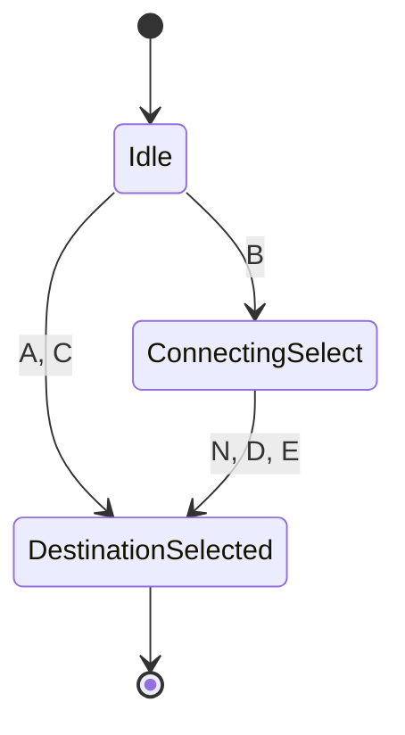
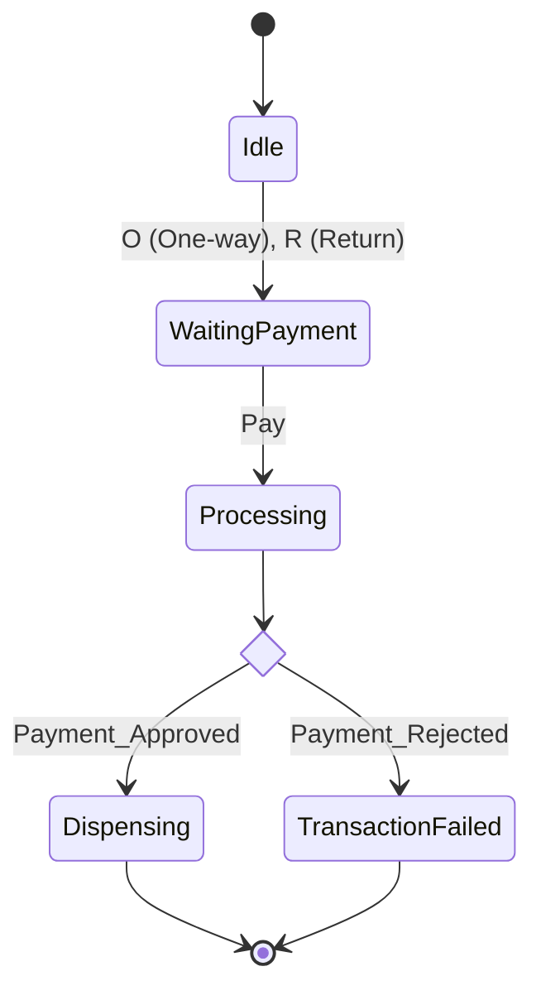
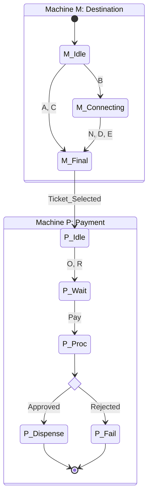

# Coursework Solution Report

## Phase 1: Exercise 1 (Train Ticket Machine)

### Machine M (Destination)

**Description**: This machine handles the destination selection. Direct destinations (A, C) lead immediately to selection. Destination B requires a secondary selection (N, D, E) for connecting trains.

**Mermaid Diagram**:



**Testing Table (Machine M)**:

| Path Type | Input Sequence | Outcome | Explanation |
| :--- | :--- | :--- | :--- |
| **Accepted** | `A` | **Pass** | Direct selection of destination A leads to the final state. |
| **Accepted** | `B` $\to$ `D` | **Pass** | Selection of B transitions to intermediate state, then D completes the selection. |
| **Rejected** | `B` $\to$ `A` | **Fail** | Input `A` is not valid in the `ConnectingSelect` state (only N, D, E allowed). |
| **Rejected** | `N` | **Fail** | `N` is not a valid initial input from the `Idle` state. |

---

### Machine P (Payment)

**Description**: Handles ticket type selection and payment processing.

**Mermaid Diagram**:



**Testing Table (Machine P)**:

| Path Type | Input Sequence | Outcome | Explanation |
| :--- | :--- | :--- | :--- |
| **Accepted** | `O` $\to$ `Pay` $\to$ `Approved` | **Pass** | Valid flow: Ticket selected, payment initiated, payment approved. |
| **Accepted** | `R` $\to$ `Pay` $\to$ `Rejected` | **Pass** | Valid flow ending in failure state due to payment rejection. |
| **Rejected** | `Pay` | **Fail** | Cannot pay before selecting a ticket type (O or R). |
| **Rejected** | `O` $\to$ `O` | **Fail** | System expects `Pay` after `O`, not another ticket selection (assuming rigid sequencing). |

---

### Machine X (Combined)

**Description**: Integrates Machine M and Machine P. The successful selection of a destination in M triggers the ticket type selection in P.

**Mermaid Diagram**:



**Testing Table (Machine X)**:

| Path Type | Input Sequence | Outcome | Explanation |
| :--- | :--- | :--- | :--- |
| **Accepted** | `A` $\to$ `O` $\to$ `Pay` | **Pass** | `A` completes M, triggering P. `O` then `Pay` completes P successfully. |
| **Accepted** | `B` $\to$ `N` $\to$ `R` $\to$ `Pay` | **Pass** | Complex destination selection (M) followed by Return ticket payment (P). |
| **Rejected** | `B` $\to$ `O` | **Fail** | `O` is entered before M is completed (M is waiting for N, D, or E). |
| **Rejected** | `A` $\to$ `Pay` | **Fail** | Machine P expects `O` or `R` first; cannot skip to `Pay` immediately after M completes. |

---

## Phase 2: Exercise 2 (Math & Minimization)

### Minimization Tree (Example)

**Method**: The **State Equivalence Method** (or Partition Refinement) works by initially creating partitions of states that are distinguishable (e.g., Final vs. Non-Final states) and iteratively splitting these partitions if states within them transition to different partitions for the same input.

**Constructed Example Tree**:
Assumption: A simple DFA with states $\{q_0...q_5\}$ where $q_5$ is the only accepting state.

1.  **Level 0 (Root)**: Initial Separation
    *   $\text{Partition}_0 = \{ \{q_0, q_1, q_2, q_3, q_4\}, \{q_5\} \}$ (Non-accepting vs Accepting)
2.  **Level 1**: Check transitions on input '0' and '1'.
    *   If $q_0, q_1$ go to Non-accepting set, but $q_2$ goes to Accepting set on input '1', they are distinguishable.
    *   $\text{Partition}_1 = \{ \{q_0, q_1\}, \{q_2, q_3, q_4\}, \{q_5\} \}$
3.  **Level 2**: Refine further until stable.
    *   Split $\{q_2, q_3, q_4\}$ if $q_2 \to q_0$ but $q_3 \to q_5$.
    *   $\text{Result} = \{ \{q_0, q_1\}, \{q_2\}, \{q_3, q_4\}, \{q_5\} \}$ (Example final distinguishable sets)

### Modulo 4 Machine Transition Table

**Logic**: $S_{next} = (S_{current} \times 10 + \text{Input}) \mod 4$
**States**: $q_0$ (Rem 0), $q_1$ (Rem 1), $q_2$ (Rem 2), $q_3$ (Rem 3).
**Accepting State**: $q_0$

| Current State | Input ($d$) | Next State ($10 \times S + d \mod 4$) | Calculation |
| :--- | :--- | :--- | :--- |
| **$q_0$** | 0 | $q_0$ | $(0 + 0) \% 4 = 0$ |
| **$q_0$** | 1 | $q_1$ | $(0 + 1) \% 4 = 1$ |
| **$q_0$** | 2 | $q_2$ | $(0 + 2) \% 4 = 2$ |
| **$q_0$** | 3 | $q_3$ | $(0 + 3) \% 4 = 3$ |
| **$q_0$** | 4 | $q_0$ | $(0 + 4) \% 4 = 0$ |
| ... | ... | ... | ... |
| **$q_1$** | 0 | $q_2$ | $(10 + 0) \% 4 = 2$ |
| **$q_1$** | 1 | $q_3$ | $(10 + 1) \% 4 = 3$ |
| **$q_1$** | 2 | $q_0$ | $(10 + 2) \% 4 = 0$ |
| **$q_1$** | 3 | $q_1$ | $(10 + 3) \% 4 = 1$ |
| **$q_1$** | 4 | $q_2$ | $(10 + 4) \% 4 = 2$ |
| ... | ... | ... | ... |
| **$q_2$** | 0 | $q_0$ | $(20 + 0) \% 4 = 0$ |
| **$q_2$** | 1 | $q_1$ | $(20 + 1) \% 4 = 1$ |
| **$q_2$** | 2 | $q_2$ | $(20 + 2) \% 4 = 2$ |
| ... | ... | ... | ... |
| **$q_3$** | 0 | $q_2$ | $(30 + 0) \% 4 = 2$ |
| **$q_3$** | 1 | $q_3$ | $(30 + 1) \% 4 = 3$ |
| **$q_3$** | 2 | $q_0$ | $(30 + 2) \% 4 = 0$ |

*(Note: Pattern repeats. $Input \mod 4$ added to $(State \times 2) \mod 4$)*

---

## Phase 3: Exercise 3 (Intruder Alert System)

### Critical Comparison: DFA vs. NFA

**Determinism**: The fundamental difference lies in predictability. A **Deterministic Finite Automaton (DFA)** allows exactly one transition for every state-input pair, ensuring a single, unique execution path for any given string. In contrast, a **Non-Deterministic Finite Automaton (NFA)** may have multiple transitions (or none) for the same input, effectively exploring multiple paths simultaneously or allowing "guessing." This makes DFA behavior rigid and predictable, while NFA behavior is more abstract.

**Complexity**: While NFAs are often easier to design and more compact, they come at a theoretical cost. An NFA with $N$ states can recognize languages that require up to $2^N$ states in an equivalent DFA. This explicit state explosion in DFAs occurs because the DFA must track every possible combination of states the NFA could be in. However, for verification and checking, this explicitness is often necessary.

**Implementation**: In terms of software and hardware implementation, **DFAs are superior**. A DFA can be implemented as a simple 2D lookup table ($States \times Inputs$), allowing for $O(1)$ transition time and $O(M)$ processing time for a string of length $M$. Implementing an NFA requires backtracking algorithms or maintaining a set of current states, which increases runtime overhead. Therefore, compilers and network protocols typically convert theoretical NFAs into minimal DFAs for efficient execution.

### Intruder Alert System (Yakindu Statechart Specification)

**Assumptions**:
1.  **Ambiguity Resolution**: Pressing the button while the alarm rings **immediately silences the alarm** and **returns the system to the Armed state**, but toggles the internal response mode (e.g., from Mode I to Mode II) for the next trigger.
2.  **No Motion**: The "Alarm stops if no motion for 30 seconds" constraint implies a timer that resets the system to Armed if not re-triggered.

**Pseudo-code Specification**:

```text
Statechart: IntruderSystem
Variables:
    boolean mode_II_active = false  // false = Mode I (Siren), true = Mode II (Siren+Lamp)

Region Main:
    // Initial State
    Entry Point --> Armed

    State Armed:
        // Transition: Motion detected triggers alarm
        on event motion_detected -> CheckMode

    // Transient decision node to route based on mode
    State CheckMode (Choice):
        if (mode_II_active == false) -> ModeI_Alarm
        if (mode_II_active == true)  -> ModeII_Alarm

    State ModeI_Alarm:
        entry: siren.on()
        exit: siren.off()
        
        // Timer Rule: Auto-shutoff
        after 30s -> Armed
        
        // Button Rule: Silence and Toggle Mode
        on event button_press:
            mode_II_active = true
            -> Armed

    State ModeII_Alarm:
        entry: siren.on(); lamp.on()
        exit: siren.off(); lamp.off()
        
        // Timer Rule: Auto-shutoff
        after 30s -> Armed
        
        // Button Rule: Silence and Toggle Mode
        on event button_press:
            mode_II_active = false
            -> Armed

```
