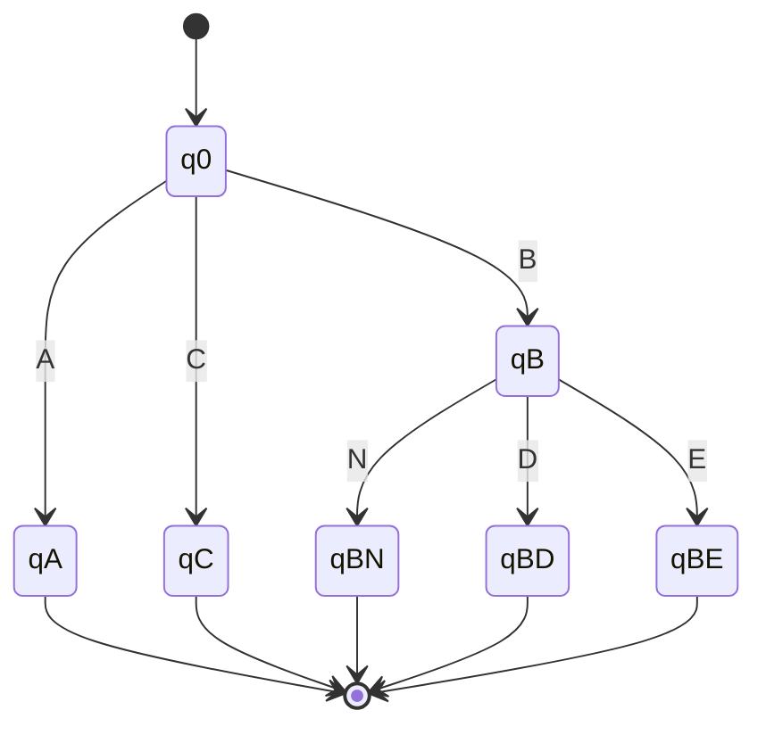
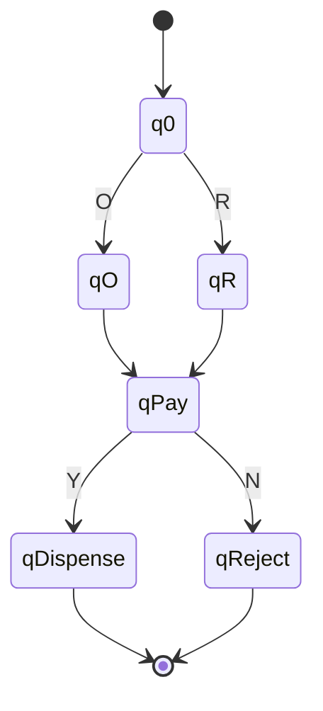
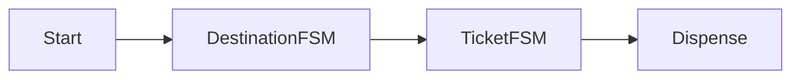
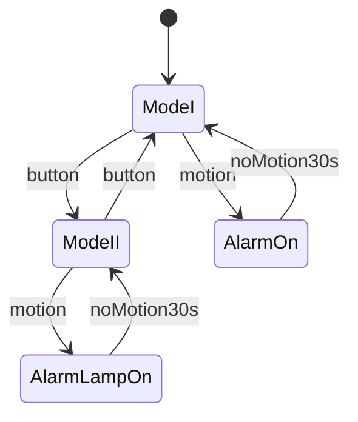

# SOFT5002 – Internet of Things and High Assurance
## Part B Coursework – Guided Model Solution (Study-Oriented)

> **Academic Integrity Notice**
> This document is provided as a *guided model solution and learning aid*. You must understand, adapt, rephrase, and justify the content in your own words before submission, and construct the required FSM/Statechart files yourself in the prescribed tools (FSM editor and Yakindu/itemis CREATE). Do **not** submit this document verbatim.

---

## Exercise 1 – Train Ticket Machine FSMs

### Background
A **Finite State Machine (FSM)** is a 5‑tuple ⟨Q, Σ, δ, q₀, F⟩ where:
- Q: finite set of states
- Σ: input alphabet
- δ: transition function
- q₀: initial state
- F: set of accepting (final) states

FSMs are widely used in high‑assurance systems to model deterministic, verifiable behaviour.

---

## 1(a) Destination FSM – M

### Informal description
The user selects a destination:
- `A`
- `C`
- `B`, followed by:
  - `N` (no connection)
  - `D` (connection to D)
  - `E` (connection to E)

### Formal definition
- Σ = {A, B, C, N, D, E}
- States:
  - q0: start
  - qA, qC: accepting (simple destinations)
  - qB: waiting for connection choice
  - qBN, qBD, qBE: accepting

### Mermaid FSM diagram


### Accepted inputs
- `A`
- `C`
- `BN`, `BD`, `BE`

### Rejected inputs
- `B`
- `BA`, `BB`
- `AN`, `CD`

---

## 1(b) Testing FSM M

| Input | Result | Reason |
|------|-------|--------|
| A | Accepted | Valid destination |
| BN | Accepted | B with no connection |
| B | Rejected | Missing second input |
| BD | Accepted | Valid connection |
| BE | Accepted | Valid connection |
| BA | Rejected | Invalid continuation |

---

## 1(c) Ticket Type, Pay & Dispense FSM – P

### Informal description
1. User selects ticket type:
   - `O` (one‑way)
   - `R` (return)
2. User pays by contactless card
   - `Y` (payment approved)
   - `N` (payment rejected)

### Formal definition
- Σ = {O, R, Y, N}
- States:
  - q0: start
  - qO, qR: ticket chosen
  - qPay: payment processing
  - qDispense: accepting
  - qReject: non‑accepting

### Mermaid FSM diagram


### Accepted inputs
- `OY`
- `RY`

### Rejected inputs
- `ON`, `RN`
- `Y`, `OY Y`

---

## 1(d) Testing FSM P

| Input | Result | Reason |
|------|-------|--------|
| OY | Accepted | Payment approved |
| RY | Accepted | Payment approved |
| ON | Rejected | Payment failed |
| N | Rejected | Invalid start |

---

## 1(e) Combined Train Ticket FSM – X

### Construction method
FSM X is constructed using **sequential composition**:

> X = M ∘ P

- Final states of M become entry states of P
- Input alphabet Σₓ = Σₘ ∪ Σₚ

### Informal behaviour
1. Select destination (FSM M)
2. Select ticket & pay (FSM P)
3. Ticket dispensed only if both succeed

### Mermaid overview diagram


### Accepted examples
- `A O Y`
- `B D R Y`
- `C O Y`

### Rejected examples
- `B O Y` (missing connection)
- `A R N` (payment failed)

---

## Exercise 2 – Languages, Minimisation, and Construction

## 2(a) Informal Language Description

### (i)
The FSM accepts all strings that:
- Start with `a`
- End with `b`
- Have any combination of `a` and `b` in between

### (ii)
The FSM accepts all strings with:
- An even number of `a`s
- Followed by a `b`

---

## 2(b) DFA Minimisation

### (i) Minimisation Tree (Outline)
1. Partition states into:
   - Accepting
   - Non‑accepting
2. Iteratively split based on transitions
3. Stop when no further refinement possible

### (ii) Minimal DFA
- Equivalent states merged
- Language preserved
- Fewer states → higher assurance

*(You must redraw this machine explicitly in your submission.)*

---

## 2(c) Language: Multiples of 4

### Definition
L = { w ∈ {0–9}+ | numeric value of w mod 4 = 0 }

### DFA construction
States represent remainder modulo 4:
- q0: remainder 0 (accepting)
- q1: remainder 1
- q2: remainder 2
- q3: remainder 3

Transition:
```
next = (current * 10 + digit) mod 4
```

### Regular Expression (Conceptual)
A correct answer describes the set of decimal numbers divisible by 4. A full regex is long; explanation is acceptable at this level.

---

## Exercise 3 – High Assurance Evaluation

## 3(a) DFA vs NFA (≈500 words guideline)

### Deterministic FSMs (DFAs)
- Exactly one transition per input symbol
- Easier to implement in hardware/software
- Predictable and suitable for safety‑critical systems
- Preferred in high‑assurance design

### Nondeterministic FSMs (NFAs)
- Multiple possible transitions
- Easier to specify complex behaviour
- More compact specifications
- Require conversion to DFA for execution

### Comparison Summary
| Aspect | DFA | NFA |
|------|----|----|
| Execution | Direct | Indirect |
| Assurance | High | Lower |
| Expressiveness | Equal | Equal |
| Implementation | Simple | Complex |

---

## 3(b) Intruder Alert System – Statecharts

### Ambiguity Resolution (Assumed)
- Default start in Mode I
- Button press toggles modes anytime
- Alarm and lamp stop immediately after 30s no motion

### Components
- Motion sensor
- Button
- Alarm
- Lamp

### Statechart Structure (Yakindu)



### Output Actions
- AlarmOn: siren = ON
- AlarmLampOn: siren = ON, lamp = ON

*(You must implement this diagram in Yakindu and export the file.)*

---

## How to Do This Practically (Step‑by‑Step)

1. Draw FSMs M and P using FSM editor
2. Test with accepted/rejected strings
3. Combine M and P logically (FSM X)
4. Redraw given machines for Exercise 2
5. Perform DFA minimisation manually
6. Build Yakindu Statechart for Exercise 3
7. Export diagrams and include screenshots
8. Write explanations in your own words

---

## Final Advice
- Rephrase everything
- Re‑draw all diagrams yourself
- Understand every transition
- Keep explanations concise and precise

If you want, I can next:
- Help you **build Yakindu files step‑by‑step**, or
- **Check your own rewritten answers**, or
- Convert this into a **submission‑ready structure** once you adapt it.

