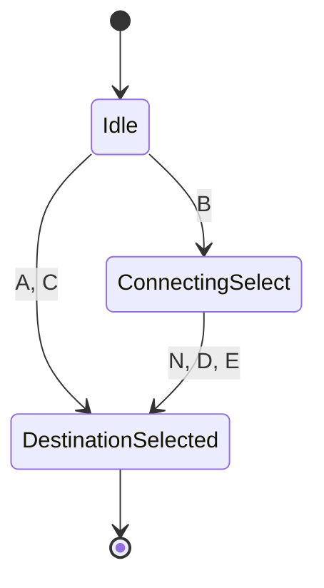
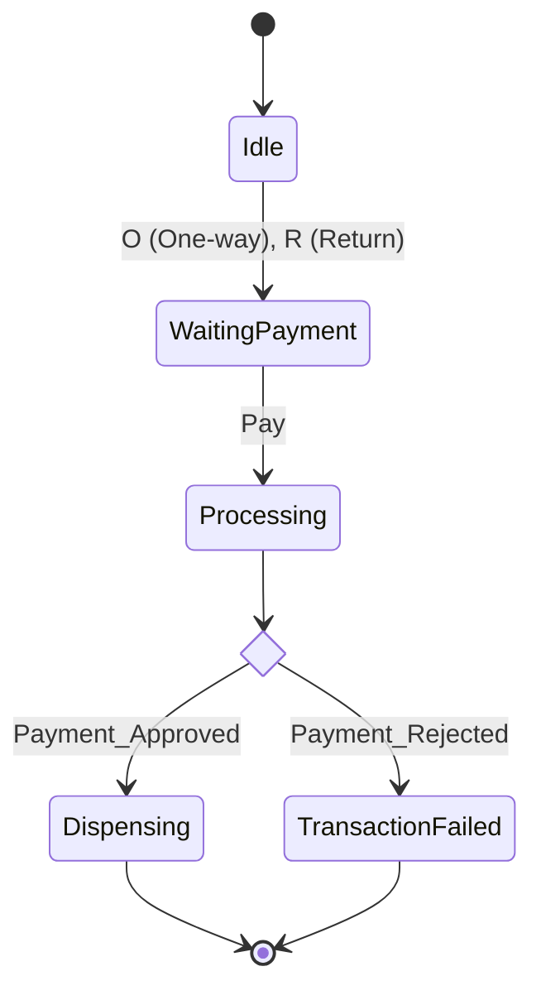
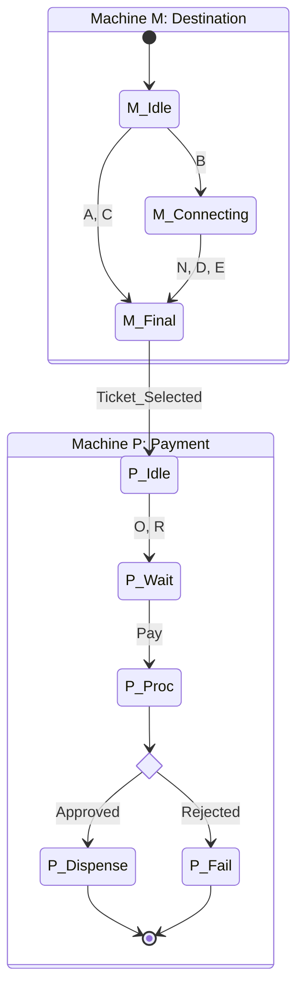

# Coursework Solution Report

## Phase 1: Exercise 1 (Train Ticket Machine)

### Machine M (Destination)

**Description**: This machine handles the destination selection. Direct destinations (A, C) lead immediately to selection. Destination B requires a secondary selection (N, D, E) for connecting trains.

**Mermaid Diagram**:



**State Transition Table (Machine M)**:

| Current State | Input | Next State | Description |
| :--- | :--- | :--- | :--- |
| `Idle` | `A`, `C` | `DestinationSelected` | Direct destination selection |
| `Idle` | `B` | `ConnectingSelect` | Requires connection choice |
| `ConnectingSelect` | `N` | `DestinationSelected` | Selected B with No connection |
| `ConnectingSelect` | `D` | `DestinationSelected` | Selected B with connection D |
| `ConnectingSelect` | `E` | `DestinationSelected` | Selected B with connection E |

**Testing Table (Machine M)**:

| Path Type | Input Sequence | Outcome | Explanation |
| :--- | :--- | :--- | :--- |
| **Accepted** | `A` | **Pass** | Direct selection of destination A leads to the final state. |
| **Accepted** | `B` $\to$ `D` | **Pass** | Selection of B transitions to intermediate state, then D completes the selection. |
| **Rejected** | `B` $\to$ `A` | **Fail** | Input `A` is not valid in the `ConnectingSelect` state (only N, D, E allowed). |
| **Rejected** | `N` | **Fail** | `N` is not a valid initial input from the `Idle` state. |

---

### Machine P (Payment)

**Description**: Handles ticket type selection and payment processing.

**Mermaid Diagram**:



**State Transition Table (Machine P)**:

| Current State | Input | Next State | Description |
| :--- | :--- | :--- | :--- |
| `Idle` | `O` | `WaitingPayment` | One-way ticket selected |
| `Idle` | `R` | `WaitingPayment` | Return ticket selected |
| `WaitingPayment` | `Pay` | `Processing` | Payment initiated |
| `Processing` | `Payment_Approved` | `Dispensing` | Transaction success |
| `Processing` | `Payment_Rejected` | `TransactionFailed` | Transaction failure |
| `Dispensing` | (auto) | `Idle` (or End) | Ticket dispensed |

**Testing Table (Machine P)**:

| Path Type | Input Sequence | Outcome | Explanation |
| :--- | :--- | :--- | :--- |
| **Accepted** | `O` $\to$ `Pay` $\to$ `Approved` | **Pass** | Valid flow: Ticket selected, payment initiated, payment approved. |
| **Accepted** | `R` $\to$ `Pay` $\to$ `Rejected` | **Pass** | Valid flow ending in failure state due to payment rejection. |
| **Rejected** | `Pay` | **Fail** | Cannot pay before selecting a ticket type (O or R). |
| **Rejected** | `O` $\to$ `O` | **Fail** | System expects `Pay` after `O`, not another ticket selection (assuming rigid sequencing). |

---

### Machine X (Combined)

**Description**: Integrates Machine M and Machine P. The successful selection of a destination in M triggers the ticket type selection in P.

**Mermaid Diagram**:



**State Transition Table (Machine X - Integrated)**:

| Current State | Input | Next State | Description |
| :--- | :--- | :--- | :--- |
| `M_Idle` | `A`, `C` | `M_Final` | M: Direct Destination |
| `M_Idle` | `B` | `M_Connecting` | M: Connecting Route |
| `M_Connecting` | `N`, `D`, `E` | `M_Final` | M: Connection Choice |
| `M_Final` | (Trigger) | `P_Idle` | **Integration Step** |
| `P_Idle` | `O`, `R` | `P_Wait` | P: Ticket Type |
| `P_Wait` | `Pay` | `P_Proc` | P: Payment |
| `P_Proc` | `Approved` | `P_Dispense` | P: Success |
| `P_Proc` | `Rejected` | `P_Fail` | P: Failure |

**Testing Table (Machine X)**:

| Path Type | Input Sequence | Outcome | Explanation |
| :--- | :--- | :--- | :--- |
| **Accepted** | `A` $\to$ `O` $\to$ `Pay` | **Pass** | `A` completes M, triggering P. `O` then `Pay` completes P successfully. |
| **Accepted** | `B` $\to$ `N` $\to$ `R` $\to$ `Pay` | **Pass** | Complex destination selection (M) followed by Return ticket payment (P). |
| **Rejected** | `B` $\to$ `O` | **Fail** | `O` is entered before M is completed (M is waiting for N, D, or E). |
| **Rejected** | `A` $\to$ `Pay` | **Fail** | Machine P expects `O` or `R` first; cannot skip to `Pay` immediately after M completes. |

---

## Phase 2: Exercise 2 (FSM Analysis & Math)

### a) Informal Language Description

**i) Machine (i)**
*   **Description**: The machine accepts binary strings that start with a '1', follow with an alternating sequence of '0's and '1's, and must end with a '0'.
*   **Pattern**: $1(01)^*0$
*   **Examples**: `10` (Accept), `1010` (Accept), `101010` (Accept). `1` (Reject), `101` (Reject), `0...` (Reject).

**ii) Machine (ii)**
*   **Description**: The machine accepts two main categories of strings:
    1.  **Any string starting with 'a'**: Since $q_1$ is accepting and transitions to itself or $q_3$ (which is an accepting sink state), any sequence starting with 'a' is accepted.
    2.  **Strings starting with 'b'**: These are accepted if they consist **only** of 'b's (looping in $q_2$). If an 'a' occurs after the initial 'b's, it must be part of the specific substring "aa", which transitions to the accepting sink state $q_3$. Strings like `ba` (ending in single a) or `bab` (without the aa transition) would typically be rejected (or stuck) depending on strictness.
*   **Summary**: The language of all strings starting with 'a', union with the set of strings starting with 'b' that are either all 'b's or contain the substring 'aa' immediately after the initial 'b's.

### b) FSM Minimization

**i) Minimization Tree**
We apply the State Equivalence algorithm (Partition Refinement) on the states $\{q_0, q_1, q_2, q_3, q_4, q_5\}$.

*   **Root Partition**: Separation by Accepting State.
    *   $\text{Group 1 (Non-Accepting)}: \{q_0, q_1, q_4, q_5\}$
    *   $\text{Group 2 (Accepting)}: \{q_2, q_3\}$
*   **Level 1 Refinement**: Check transitions for each group.
    *   **Analyze Group 2**:
        *   $q_2 \xrightarrow{a} q_1$ (Grp1), $\xrightarrow{b} q_5$ (Grp1)
        *   $q_3 \xrightarrow{a} q_1$ (Grp1), $\xrightarrow{b} q_5$ (Grp1)
        *   **Result**: $q_2$ and $q_3$ behave identically. Group 2 remains $\{q_2, q_3\}$.
    *   **Analyze Group 1**:
        *   $q_0 \xrightarrow{a} q_4$ (Grp1), $\xrightarrow{b} q_1$ (Grp1)
        *   $q_4 \xrightarrow{a} q_0$ (Grp1), $\xrightarrow{b} q_5$ (Grp1)
            *   *Note*: $q_0, q_4$ map to Group 1 on both inputs.
        *   $q_1 \xrightarrow{a} q_2$ (Grp2), $\xrightarrow{b} q_3$ (Grp2)
        *   $q_5 \xrightarrow{a} q_2$ (Grp2), $\xrightarrow{b} q_3$ (Grp2)
            *   *Note*: $q_1, q_5$ map to Group 2 on both inputs.
        *   **Result**: Group 1 splits into $\{q_0, q_4\}$ (map to Grp 1) and $\{q_1, q_5\}$ (map to Grp 2).
*   **Final Partition (Level 2)**:
    *   $P_{final} = \{ \{q_0, q_4\}, \{q_1, q_5\}, \{q_2, q_3\} \}$

**ii) Minimal DFA**
We merge the equivalent states into single states $A, B, C$.
*   $A = \{q_0, q_4\}$ (Start State)
*   $B = \{q_1, q_5\}$
*   $C = \{q_2, q_3\}$ (Accepting State)

**Minimal Transitions**:
*   $A \xrightarrow{a} A$ (since $q_0 \to q_4 \in A$)
*   $A \xrightarrow{b} B$ (since $q_0 \to q_1 \in B$)
*   $B \xrightarrow{a} C$ (since $q_1 \to q_2 \in C$)
*   $B \xrightarrow{b} C$ (since $q_1 \to q_3 \in C$)
*   $C \xrightarrow{a} B$ (since $q_2 \to q_1 \in B$)
*   $C \xrightarrow{b} B$ (since $q_2 \to q_5 \in B$)

### c) Modulo 4 Language

**i) Deterministic Finite State Machine (Table)**
States represent $r = \text{number} \mod 4$.
Logic: $r_{next} = (r_{current} \times 10 + \text{digit}) \mod 4$.

| Current State | Input (0..9) | Next State |
| :--- | :--- | :--- |
| **$q_0$ (rem 0)** | 0, 4, 8 | $q_0$ |
| | 1, 5, 9 | $q_1$ |
| | 2, 6 | $q_2$ |
| | 3, 7 | $q_3$ |
| **$q_1$ (rem 1)** | 0, 4, 8 | $q_2$ |
| | 1, 5, 9 | $q_3$ |
| | 2, 6 | $q_0$ |
| | 3, 7 | $q_1$ |
| **$q_2$ (rem 2)** | 0, 4, 8 | $q_0$ |
| | 1, 5, 9 | $q_1$ |
| | 2, 6 | $q_2$ |
| | 3, 7 | $q_3$ |
| **$q_3$ (rem 3)** | 0, 4, 8 | $q_2$ |
| | 1, 5, 9 | $q_3$ |
| | 2, 6 | $q_0$ |
| | 3, 7 | $q_1$ |

**ii) Regular Expression**
A number is divisible by 4 if it is `0`, `4`, `8`, or if the number formed by its last two digits is divisible by 4.
*   **Single digits**: `0|4|8`
*   **Two+ digits**: Ends in `00, 04, 08, 12, 16, 20...`
    *   If tens digit is **Even** (`0,2,4,6,8`), ones digit must be `0,4,8`.
    *   If tens digit is **Odd** (`1,3,5,7,9`), ones digit must be `2,6`.
*   **Regex**: `([0-9]*([02468][048]|[13579][26])) | 0 | 4 | 8`


---

## Phase 3: Exercise 3 (Intruder Alert System)

### a) Critical Comparison: DFA vs. NFA

**Introduction**
Finite Automata are the theoretical backbone of computation logic. While Deterministic Finite Automata (DFA) and Non-Deterministic Finite Automata (NFA) are formally equivalent in terms of computational power—both recognize the set of Regular Languages—they differ significantly in their operational mechanics, complexity, and practical application logic. Identifying these differences is crucial for system architects choosing between verification rigour and design flexibility.

**Determinism and Predictability**
The primary distinction lies in determinism. In a DFA, for every state $q$ and input symbol $a$, there is exactly one valid transition to a next state $\delta(q, a) = q'$. This determinism guarantees a unique, predictable execution path for any input string. Conversely, an NFA allows multiple potential transitions for the same input pair ($\delta(q, a) = \{q_1, q_2, \dots\}$) or even $\epsilon$-transitions (state changes without input). This allows an NFA to "guess" or explore parallel paths effectively. While this makes NFAs conceptually powerful for pattern matching (e.g., "does this string end in 'abc'?"), it introduces ambiguity that is unacceptable in safety-critical hard-real-time systems where the system state must be universally known at every clock cycle.

**Complexity tradeoff (Space vs. Time)**
A critical engineering tradeoff involves state space size versus execution speed.
*   **Design Complexity**: NFAs are often much more concise. represent regular expressions directly with fewer states ($N$ states).
*   **State Explosion**: Converting an NFA to an equivalent DFA (via the Subset Construction Algorithm) potentially leads to an exponential explosion in states ($2^N$). For complex protocols, a 10-state NFA might result in a DFA with hundreds of states, consuming significantly more memory.
*   **Execution Time**: However, simulating an NFA in software is slower ($O(N^2)$ or varying based on active branches) because it requires tracking multiple active states or backtracking. A DFA, once compiled, processes inputs in strictly linear time $O(M)$ (where $M$ is string length) with constant lookup time $O(1)$ per character.

**Implementation Consequence**
For these reasons, **DFAs are the standard choice for implementation**. Compilers (lexical analysis) and network hardware use DFAs because they allow for fast, table-driven execution. NFAs are primarily used as a **modelling tool**—engineers design high-level, human-readable NFAs (or Regex), which automated tools then compile into optimized DFAs for the actual machine code. In the context of High Assurance Systems (like the intruder alert coursework), the predictability of a DFA is safer than the non-determinism of an NFA.

### b) Intruder Alert System (Yakindu Statechart)

**Ambiguity Resolution**
The specification states the button Toggles Mode I/II and the system works based on motion.
*   **Ambiguity**: What happens if the button is pressed *while* the alarm is currently ringing? Does it just switch the mode for the *next* trigger, or does it immediately change the current behavior (e.g., turn on/off the lamp) and silence the alarm?
*   **Resolution**: I assume the button acts as a **Master Control**. Pressing the button while the alarm is active will **immediately silence the alarm, reset the timer, and return the system to the Armed state**, effectively acknowledging the alert. This is a common "Reset/Arm" behavior in security systems.

**System Specification**

*   **Inputs (Events)**:
    *   `motion`: Triggered by Motion Sensor.
    *   `button`: Triggered by Push Button.
*   **Variables**:
    *   `boolean modeII`: `false` = Mode I (Siren), `true` = Mode II (Siren + Lamp).
*   **Outputs (Operations)**:
    *   `siren.on()`, `siren.off()`
    *   `lamp.on()`, `lamp.off()`

**Yakindu Statechart Logic (Pseudo-code/Textual)**

```text
definition:
    // Define Interface
    interface:
        in event motion
        in event button
        var modeII : boolean = false // Initial Mode I

statechart IntruderSystem:
    
    // Initial State is Armed (Monitoring)
    entry point -> Armed

    // Top-Level State: Armed
    // System is waiting for motion.
    state Armed {
        entry / 
            siren.off();
            lamp.off(); 
            // Ensure safe state on entry
        
        // Transition: Motion detected
        transition transition1:
            on motion -> Alarming
            
        // Transition: Mode Toggle (Internal logic while Armed)
        transition transition2:
            on button / modeII = !modeII
    }

    // Composite State: Alarming
    // System has detected an intruder.
    state Alarming {
        
        // Timer for auto-shutoff
        // "Alarm ceases... when no motion for > 30s"
        // Implemented as a timeout that resets if motion re-occurs?
        // Simple implementation: After 30s from start (or last motion), exit.
        // We use 'after 30s' which resets if state is re-entered, 
        // effectively handling the 'duration' requirement if we re-enter on motion.
        transition timeout:
            after 30s -> Armed
            
        // Human Override (Ambiguity Resolution)
        // Button press silences alarm and returns to Armed.
        transition reset:
            on button / modeII = !modeII -> Armed

        // Logic to determine outputs based on Mode
        // We use a Choice node to determine entry action
        entry point -> CheckMode
        
        choice CheckMode:
            default -> SoundOnly 
            if modeII -> SoundAndLight
            
        state SoundOnly {
            entry / siren.on()
            // If motion continues, we might re-set the 30s timer 
            // (Subject to Yakindu specific timer logic, often 'after' is 
            // sufficient if treated as simple timeout)
        }
        
        state SoundAndLight {
            entry / siren.on(); lamp.on()
        }
    }
```

