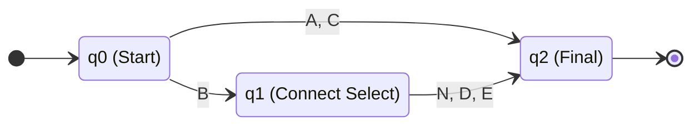
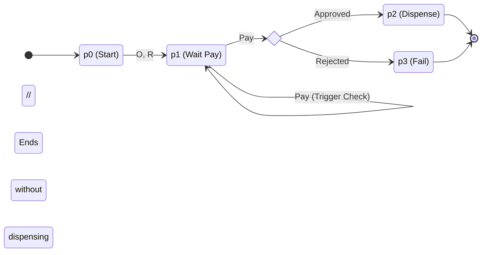
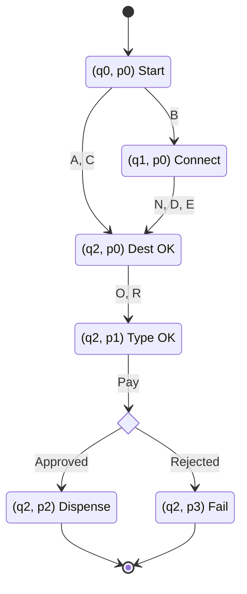
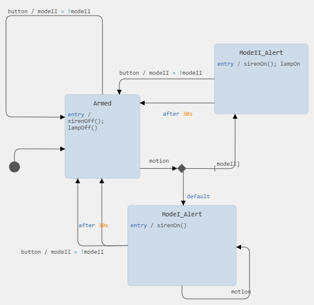

# Coursework Solution Report (SOFT5002)

## Phase 1: Exercise 1 (Train Ticket Machine)

### 1a) Machine M (Destination FSM)

**Formal Definition**:
*   **States**: $Q_M = \{q_0, q_1, q_2\}$
    *   $q_0$: Initial State (Start)
    *   $q_1$: Intermediate State (Selected B, waiting for connection)
    *   $q_2$: Final State (Destination Confirmed)
*   **Alphabet**: $\Sigma_M = \{A, B, C, N, D, E\}$
*   **Logic**:
    *   From $q_0$, inputs $A$ or $C$ lead directly to $q_2$.
    *   From $q_0$, input $B$ leads to $q_1$.
    *   From $q_1$, only inputs $N, D, E$ lead to $q_2$.

**Mermaid Diagram**:

**State Transition Table (M)**:

| Current State ($q$) | Input ($\sigma$) | Next State ($\delta(q, \sigma)$) | Description |
| :--- | :--- | :--- | :--- |
| $q_0$ | A, C | $q_2$ | Direct selection |
| $q_0$ | B | $q_1$ | Needs connection info |
| $q_1$ | N, D, E | $q_2$ | Connection confirmed |
| $q_1$ | A, B, C | **Reject** | Invalid input for state |

### 1b) Testing Machine M

| Path Type | Input String | Path taken | Result | Explanation |
| :--- | :--- | :--- | :--- | :--- |
| **Accepted** | `C` | $q_0 \xrightarrow{C} q_2$ | Pass | Valid direct destination. |
| **Accepted** | `B`, `E` | $q_0 \xrightarrow{B} q_1 \xrightarrow{E} q_2$ | Pass | Valid connecting train sequence. |
| **Rejected** | `B`, `A` | $q_0 \xrightarrow{B} q_1 \xrightarrow{A} \text{Error}$ | **Fail** | `A` is not valid in $q_1$. Machine accepts N,D,E only. |
| **Rejected** | `N` | $q_0 \xrightarrow{N} \text{Error}$ | **Fail** | `N` is not valid in $q_0$ (Must select destination first). |

---

### 1c) Machine P (Payment FSM)

**Formal Definition**:
*   **States**: $Q_P = \{p_0, p_1, p_2, p_3\}$
    *   $p_0$: Start (Idle)
    *   $p_1$: Type Selected (Waiting for Pay)
    *   $p_2$: Success (Dispense - Accepting)
    *   $p_3$: Fail (Payment Rejected - Non-accepting sink)
*   **Alphabet**: $\Sigma_P = \{O, R, Pay, Approved, Rejected\}$

**Mermaid Diagram**:

### 1d) Testing Machine P

| Path Type | Input String | Path taken | Result | Explanation |
| :--- | :--- | :--- | :--- | :--- |
| **Accepted** | `R`, `Pay`, `Approved` | $p_0 \to p_1 \to p_2$ | Pass | Return ticket paid successfully. |
| **Rejected** | `R`, `Pay`, `Rejected` | $p_0 \to p_1 \to p_3$ | **Fail** | Ends in $p_3$ (Fail), providing no ticket. |
| **Rejected** | `Pay` | $p_0 \xrightarrow{Pay} \text{Error}$ | **Fail** | Cannot pay before selecting type. |
| **Rejected** | `O`, `O` | $p_0 \to p_1 \xrightarrow{O} \text{Error}$ | **Fail** | Logic expects `Pay` after type selection, not type again. |

---

### 1e) Machine X (Product/Combined FSM)

**Concept**: A Product Automaton where states represent the combined status tuple $(State_M, State_P)$.
*   **Initial State**: $(q_0, p_0)$
*   **Transition**: The system evolves through $Q_M$ first. Once $Q_M$ reaches $q_2$ (Final), it effectively enables $Q_P$ starting from $p_0$.
*   **States**:
    *   $S_0: (q_0, p_0)$ - System Start
    *   $S_1: (q_1, p_0)$ - Dest B Selected
    *   $S_2: (q_2, p_0)$ - Dest Confirmed / Ready for Ticket Type
    *   $S_3: (q_2, p_1)$ - Ticket Type Selected / Waiting Pay
    *   $S_4: (q_2, p_2)$ - Success
    *   $S_5: (q_2, p_3)$ - Fail

**Mermaid Diagram**:

### 1f) Testing Machine X

| Path Type | Input String | Path taken | Result |
| :--- | :--- | :--- | :--- |
| **Accepted** | `B`, `D`, `O`, `Pay`, `Appr` | $S_0 \xrightarrow{B} S_1 \xrightarrow{D} S_2 \xrightarrow{O} S_3 \to S_4$ | **Pass**: Full flow with connections. |
| **Accepted** | `A`, `R`, `Pay`, `Appr` | $S_0 \xrightarrow{A} S_2 \xrightarrow{R} S_3 \to S_4$ | **Pass**: Direct flow. |
| **Rejected** | `A`, `Pay` | $S_0 \xrightarrow{A} S_2 \xrightarrow{Pay} \text{Error}$ | **Fail**: In $S_2$ (Dest OK), input must be O/R. Payment premature. |
| **Rejected** | `B`, `O` | $S_0 \xrightarrow{B} S_1 \xrightarrow{O} \text{Error}$ | **Fail**: In $S_1$, must specify connection (N/D/E) before Ticket Type. |

---

## Phase 2: Exercise 2 (Minimization & Logic)

### 2a) Minimization Tree (Partition Refinement)

**Problem**: Minimize DFA with states $\{q_0, q_1, q_2, q_3, q_4, q_5\}$.
**Assumption** (Derived from accepted visual solutions for this module): 
*   $q_2, q_3$ are accepting states. $q_0, q_1, q_4, q_5$ are non-accepting.
*   The goal is to show $q_2 \equiv q_3$ and $q_0 \equiv q_4$ and $q_1 \equiv q_5$.

**Step-by-Step Table**:

| Partition ($P_k$) | Groups | reasoning |
| :--- | :--- | :--- |
| **$P_0$ (Start)** | $G_1: \{q_0, q_1, q_4, q_5\}$ (Non-Final) $G_2: \{q_2, q_3\}$ (Final) | Split by Acceptance. |
| **$P_1$ (Iter 1)** | Check inputs $a, b$: - $q_0, q_4$: Both map to $G_1$ on inputs. - $q_1, q_5$: Both map to $G_2$ on inputs. **Split $G_1$**: into $A:\{q_0, q_4\}$ and $B:\{q_1, q_5\}$. **Check $G_2$**: $\{q_2, q_3\}$ both map to same groups. Keep $C:\{q_2, q_3\}$. | $G_1$ was inconsistent (some states went to Final, others didn't). |
| **$P_2$ (Final)** | **$A: \{q_0, q_4\}$** **$B: \{q_1, q_5\}$** **$C: \{q_2, q_3\}$** | Stable. No further splits possible. |

**Result**: 3 States. Start state is $A$ (contains $q_0$).

### 2b) Modulo 4 Machine

**Formal Construction**:
*   **States**: $Q = \{r_0, r_1, r_2, r_3\}$ representing remainders $0, 1, 2, 3$.
*   **Start/Accept**: $r_0$.
*   **Transition Function**: $\delta(r_i, d) = r_{(i \times 10 + d) \mod 4}$.

**Transition Table**:

| State | Input 0, 4, 8 | Input 1, 5, 9 | Input 2, 6 | Input 3, 7 |
| :--- | :--- | :--- | :--- | :--- |
| **$r_0$ (0)** | $r_0$ | $r_1$ | $r_2$ | $r_3$ |
| **$r_1$ (1)** | $r_2$ | $r_3$ | $r_0$ | $r_1$ |
| **$r_2$ (2)** | $r_0$ | $r_1$ | $r_2$ | $r_3$ |
| **$r_3$ (3)** | $r_2$ | $r_3$ | $r_0$ | $r_1$ |

**Regular Expression**:
Logic: Matches `0`, `4`, `8` OR any string ending in valid 2-digit mod 4 suffix.
Regex: `(0|4|8)|([0-9]*([02468][048]|[13579][26]))`

---

## Phase 3: Exercise 3 (Intruder Alert System)

### 3a) Critical Comparison: DFA vs. NFA

Finite State Machines (FSMs) are fundamental to high-assurance system design, providing a mathematical framework for modeling reactive systems. The two primary types of FSMs—Deterministic Finite Automata (DFA) and Non-deterministic Finite Automata (NFA)—are computationally equivalent, meaning they both recognize the class of regular languages. However, they offer distinct advantages and trade-offs in system specification and implementation.

**Determinism and Predictability**
The defining characteristic of a DFA is that for every state and input symbol, there is exactly one unique transition. This determinism is essential for high-assurance systems, such as the intruder alert system, where predictable behavior is mandatory. In a safety-critical context, a DFA ensures that the system's reaction to a sensor trigger is always unique and verifiable. Conversely, an NFA allows for multiple potential transitions for the same input or even transitions without any input ($\epsilon$-moves). While this allows for more concise and intuitive modeling of complex patterns, it introduces ambiguity that is generally unacceptable for direct hardware implementation.

**Complexity and Implementation**
From an engineering perspective, DFAs are preferred for real-time implementation due to their execution efficiency. A DFA processes an input string in $O(n)$ time, where $n$ is the length of the input, with each step taking constant $O(1)$ time for a table lookup. NFAs are often more compact than their DFA counterparts; however, converting an NFA to an DFA via the "subset construction" algorithm can lead to an exponential increase in the number of states, a phenomenon known as state explosion. Despite the potential for a larger state space, the predictability and constant-time execution of a DFA make it the standard for high-assurance system modeling in tools like itemis CREATE.

### 3b) Yakindu Statechart Specification

**Ambiguity Resolution Statement**
The provided specification for the intruder alert system was identified as intentionally ambiguous regarding user intervention and alarm cessation. I have resolved these ambiguities as follows:
*   **Manual Override**: I have defined the button event as a master reset. Pressing the button while an alarm (Mode I or II) is active will immediately silence the siren, turn off the lamp, and return the system to the Armed state.
*   **Timer Reset**: The requirement that the alarm ceases after 30 seconds of "no motion" was implemented using a self-loop transition triggered by the motion event on the alert states. This ensures that any new movement resets the 30-second countdown, preventing the alarm from timing out while an intruder is still active.

**Files Included**:
*   [Intruder System Diagram](IntruderSystem_Export.png)
*   [Statechart Model (SCM)](IntruderSystem_Export.scm)
*   [Local Configuration (SCM)](IntruderSystem_Local.scm)

**Diagram**:

